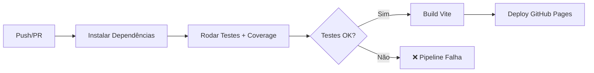

# 📅 AgendaFácil

[](https://github.com/Higor1107/atividade-avaliativa-qualidade-de-software/actions/workflows/ci.yml)
[](https://Higor1107.github.io/atividade-avaliativa-qualidade-de-software/)

Sistema de agendamentos online com filtro por cidades e múltiplos níveis de acesso. Permite que estabelecimentos gerenciem seus horários e visitantes agendem visitas de forma simples e intuitiva.

## ✨ Funcionalidades

- 🔐 **3 níveis de acesso**: Desenvolvedor, Estabelecimento e Visitante
- 🏢 **Gestão de estabelecimentos**: cadastro, edição e categorização livre
- 📅 **Calendário interativo**: criação e gerenciamento de horários disponíveis
- 🔍 **Busca com filtros**: pesquisa por nome e cidade
- 📋 **Painel do visitante**: visualização de todos os agendamentos com status
- 🔔 **Sistema de notificações**: feedback visual de todas as ações
- 📱 **Responsivo**: funciona em desktop e mobile

## 🏗️ Arquitetura

Escolhemos a arquitetura **Frontend Estático + BaaS (Supabase)** porque:

| Decisão | Justificativa |
|---------|---------------|
| **Vanilla JS (sem framework)** | Foco na qualidade do código, sem overhead desnecessário |
| **Supabase como BaaS** | Auth + Database + RLS sem precisar de backend |
| **Vite** | Build moderno e rápido com suporte nativo a ESM |
| **Vitest** | Framework de testes compatível com Jest, ESM nativo |
| **SPA com hash routing** | Deploy simples no GitHub Pages sem configuração de servidor |

### Estrutura

```
src/
├── index.html              ← SPA principal
├── css/styles.css           ← Design system completo
├── js/
│   ├── app.js              ← Router SPA + controller
│   ├── supabaseClient.js   ← Inicialização Supabase
│   ├── utils/              ← Funções puras (testáveis)
│   │   ├── validators.js   ← Validações de formulário
│   │   ├── dateUtils.js    ← Helpers de data/hora
│   │   ├── formatters.js   ← Formatação de dados
│   │   └── filters.js      ← Filtros e ordenação
│   ├── services/           ← Integração Supabase
│   │   ├── authService.js
│   │   ├── establishmentService.js
│   │   ├── appointmentService.js
│   │   └── timeSlotService.js
│   └── views/              ← Componentes de UI
│       ├── loginView.js
│       ├── dashboardView.js
│       ├── calendarView.js
│       ├── establishmentView.js
│       └── visitorView.js
tests/
├── validators.test.js      ← 53 testes
├── dateUtils.test.js        ← 42 testes
├── formatters.test.js       ← 39 testes
└── filters.test.js          ← 27 testes
```

## 🛠️ Tecnologias

- **HTML5, CSS3, JavaScript** (ES Modules)
- **[Supabase](https://supabase.com)** — Auth + PostgreSQL + Row Level Security
- **[Vite](https://vite.dev)** — Build tool
- **[Vitest](https://vitest.dev)** — Framework de testes (161 testes)
- **GitHub Actions** — CI/CD
- **GitHub Pages** — Deploy

## 🚀 Como rodar localmente

### Pré-requisitos
- [Node.js](https://nodejs.org) v18 ou superior

### Instalação

```bash
git clone https://github.com/Higor1107/atividade-avaliativa-qualidade-de-software.git
cd atividade-avaliativa-qualidade-de-software
npm install
```

### Rodar em modo desenvolvimento

```bash
npm run dev
```

Acesse `http://localhost:3000` no navegador.

### Build para produção

```bash
npm run build
npm run preview
```

## 🧪 Como rodar os testes

```bash
# Rodar todos os testes
npm test

# Rodar com coverage
npm run test:coverage

# Rodar em modo watch
npm run test:watch
```

### Resultado esperado

```
 ✓ tests/validators.test.js   (53 tests)
 ✓ tests/dateUtils.test.js    (42 tests)
 ✓ tests/formatters.test.js   (39 tests)
 ✓ tests/filters.test.js      (27 tests)

 Test Files  4 passed (4)
      Tests  161 passed (161)
```

### Threshold de Coverage

O projeto exige **80% de cobertura mínima** em branches, functions, lines e statements. A pipeline falha automaticamente se esse limite não for atingido.

## ⚙️ Pipeline CI/CD

Nossa pipeline (`.github/workflows/ci.yml`) executa automaticamente:



- **Em todo PR para `main`**: roda os 161 testes unitários com verificação de cobertura
- **Deploy automático**: quando o merge é feito na `main`, faz build e deploy no GitHub Pages

## 🔗 Link da Aplicação

[https://Higor1107.github.io/atividade-avaliativa-qualidade-de-software/](https://Higor1107.github.io/atividade-avaliativa-qualidade-de-software/)

## 👥 Integrantes

- **Gabriel Sanches de Souza** — [GitHub](https://github.com/gabriel-sanches)
- **Higo da Silva Monteiro de Souza** — [GitHub](https://github.com/Higor1107)